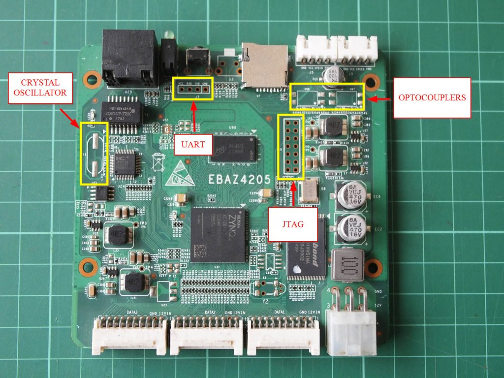
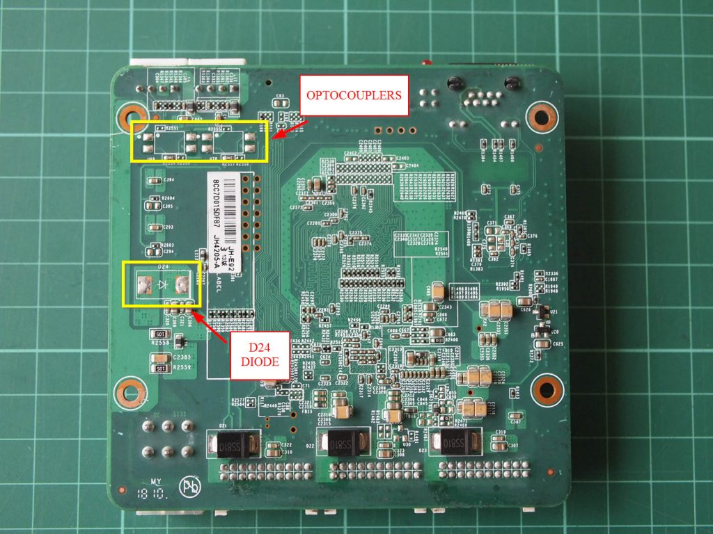
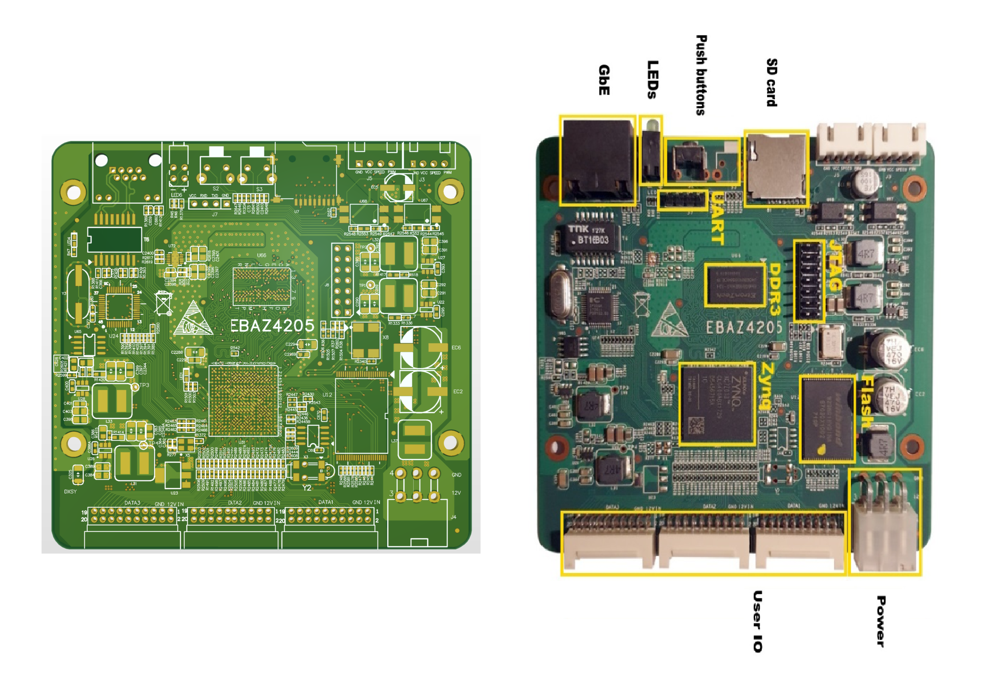

# Xilinx_ZYNQ7010_EBAZ4205

# 1. Board EBAZ4205 là gì?

EBAZ4205 là một board SoC FPGA sử dụng chip:

- Xilinx Zynq-7000 XC7Z010-1CLG400
- Tích hợp:
  - **PS (Processing System)**:
    - Dual-core ARM Cortex-A9
    - Chạy Linux, Baremetal, FreeRTOS...
    - Tích hợp DDR controller, UART, SPI, I2C, Ethernet...
  - **PL (Programmable Logic)**:
    - FPGA fabric thuộc dòng Artix-7
    - Hỗ trợ thiết kế logic số bằng Verilog/VHDL
    - Có thể tạo IP Core, DSP, giao tiếp ngoại vi custom...


## Thông số cơ bản

| Thành phần | Mô tả |
|---|---|
| SoC | XC7Z010 |
| CPU | Dual ARM Cortex-A9 |
| FPGA Logic | ~28K Logic Cells |
| RAM | DDR3 onboard |
| Boot | NAND / SD / JTAG |
| Ethernet | 10/100 PHY |
| Toolchain | Vivado / Vitis / PetaLinux |

---

# 2. Schematic EBAZ4205

## File schematic

[Xem file Schematic EBAZ4205 (PDF)](https://github.com/haphucc/Xilinx_ZYNQ7010_EBAZ4205/blob/main/Schematic/ebaz4205_schematic.pdf)

## Board TOP / BOTTOM View

<table>
<tr>
<td align="center">



</td>

<td align="center">



</td>

<td align="center">



</td>

</tr>
</table>

---

# 3. PCB EBAZ4205

## File PCB KiCad

```text
Xilinx_ZYNQ7010_EBAZ4205\PCB\kicad
```

## 3D View


---

# 4. Pinout

File pinout:

```text
Xilinx_ZYNQ7010_EBAZ4205\Pinout\ebaz4205-pinout.md
```

Pinout bao gồm:

- PS GPIO
- PL IO
- UART
- JTAG
- Ethernet
- SDIO
- Clock
- Power rails

---

# 5. Board files

Đường dẫn:

```text
Xilinx_ZYNQ7010_EBAZ4205\Board files
```

Board files dùng để:

- Import trực tiếp vào Vivado
- Tạo project Zynq nhanh chóng
- Mapping peripheral tự động
- Hỗ trợ block design

---

# 6. Mạch nạp JTAG XVC - Raspberry Pico

Đường dẫn:

```text
Xilinx_ZYNQ7010_EBAZ4205\Mạch nạp JTAG XVC - Raspberry Pico
```

Bao gồm:

- Sơ đồ kết nối Raspberry Pi Pico ↔ EBAZ4205
- Mạch nạp JTAG XVC
- Hỗ trợ debug/program FPGA qua USB
- Có thể dùng với:
  - Vivado Hardware Manager
  - OpenOCD
  - XVC Server

---

## 1. Bước chỉ làm 1 LẦN DUY NHẤT (Không cần làm lại)

### Nạp firmware `.uf2` cho Pi Pico

Sau khi đã nạp thành công, Raspberry Pi Pico sẽ giữ firmware đó vĩnh viễn trong bộ nhớ Flash.

Mỗi lần cấp nguồn:

- Pico sẽ tự động chạy firmware XVC
- Không cần nạp lại `.uf2`
- Không cần thao tác thêm

### Cài Driver bằng Zadig

Bạn chỉ cần dùng Zadig để cài driver `libusbK` cho thiết bị USB của Pi Pico một lần duy nhất.

Sau này:

- Mỗi khi cắm Pi Pico vào máy tính
- Windows sẽ tự động nhận đúng driver đã cấu hình
- Không cần mở lại Zadig

---

## 2. Bước PHẢI LÀM MỖI KHI DÙNG BOARD (Bắt buộc)

Mỗi khi bật máy tính để làm việc với board EBAZ4205, cần thực hiện 2 bước sau:

### Bước 1: Chạy XVC Daemon Server (`xvcd-pico.exe`)

- Cắm Raspberry Pi Pico vào máy tính
- Cấp nguồn 12V cho board EBAZ4205
- Mở CMD và chạy file:

```text
xvcd-pico.exe
```

Chương trình sẽ tạo Xilinx Virtual Cable Server tại:

```text
127.0.0.1:2542
```

Trong suốt quá trình làm việc:

- Giữ cửa sổ CMD đang chạy
- Có thể minimize xuống taskbar
- Không được tắt chương trình

### Bước 2: Kết nối trong Vivado (Add Xilinx Virtual Cable)

Mở:

```text
Vivado → Hardware Manager
```

Chọn:

```text
Add Xilinx Virtual Cable (XVC)
```

Sau đó nhập:

```text
Host : 127.0.0.1
Port : 2542
```

Vivado sẽ kết nối tới Raspberry Pi Pico thông qua giao thức XVC để:

- Program FPGA
- Debug JTAG
- Read Hardware Status
- Sử dụng Hardware Manager như cáp nạp Xilinx thật

